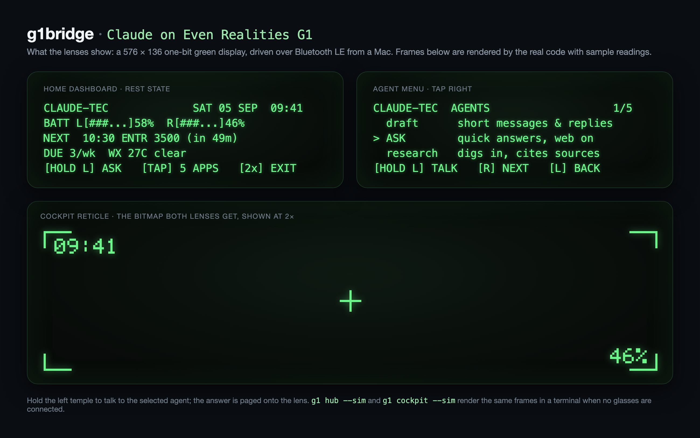

# g1bridge




Talk to a Claude agent through your **Even Realities G1** smart glasses — no phone app in the loop.

Your Mac connects to both arms of the G1 over Bluetooth LE, and a Claude agent (built on the Claude Agent SDK, authenticated with your Anthropic API key) answers onto the heads-up display. TouchBar taps page through long answers.

```
┌────────────┐   BLE (two arms)   ┌────────────┐   claude-agent-sdk   ┌──────────────┐
│ G1 glasses │◄──────────────────►│  your Mac  │◄────────────────────►│  Claude API  │
│ HUD + taps │                    │  g1bridge  │                      │  (API key)   │
└────────────┘                    └────────────┘                      └──────────────┘
```

**Status:** working prototype, Mac-side. BLE, HUD text and hold-to-talk voice
were verified on real G1 glasses on 2026-09-03. The whole hub also runs on a
terminal simulator, so nothing below needs hardware except the smoke test.

## Quickstart

macOS with [uv](https://docs.astral.sh/uv/) (it fetches Python 3.12 if needed).

```bash
git clone https://github.com/Artem1bar/g1bridge.git && cd g1bridge
uv sync
uv run pytest            # 172 unit tests, no hardware
uv run g1 hub --sim      # the whole hub on a simulated HUD in your terminal
uv run g1 cockpit --sim  # the reticle bitmap, printed as ASCII
uv run g1 --help
```

Answers come from Claude through the Claude Agent SDK (which bundles the Claude
Code runtime it drives), so `g1 chat` and the hub need an Anthropic API key
exported as `ANTHROPIC_API_KEY`. Framing, pagination, the simulator and the
tests run without it.

On your own machine you can leave `ANTHROPIC_API_KEY` unset and let the runtime
fall back to an existing Claude Code login. That is a personal-use convenience
for the developer, not a supported way to run this for anyone else.

## Status

| Piece | State |
|---|---|
| Protocol framing (0x4E text, 0xF5 events, heartbeat, mic control) | Unit-tested against the official EvenDemoApp protocol doc + community captures |
| Claude agent layer (multi-turn, Claude Agent SDK, optional WebSearch) | **Verified live** — real answer round-tripped through the Agent SDK |
| BLE connect | **Works** (2026-09-03) — both arms connect in ~3 s when the glasses are worn or in the open case; asleep on the desk they ignore connection requests ([investigation](docs/ble-investigation.md)) |
| HUD display | **Works on both arms** (2026-09-03) — after switching to the official left-ack-then-right handshake and plain Text Show status |
| Gesture events | **Measured on hardware** (2026-09-03) — long-press, double and triple taps arrive as parsed events; single-tap paging on an open answer still to confirm |
| Agent hub (menu of Claude agents on the HUD, TouchBar navigation) | **Built** — state machine + terminal simulator, 55 unit tests; runs end-to-end with `g1 hub --sim`; not yet seen on hardware |
| Voice input (glasses mic → LC3 decode → whisper.cpp → Claude → HUD) | **Works end to end on the glasses** (2026-09-03 22:47): hold the left temple, "What is the capital of France?" → "Paris." on the HUD; 5.4 s capture, 0.8 s transcription, offline, no key |
| Streaming answers, auto-reconnect | Built (simulator-verified): the first page shows while Claude is still writing; a dropped arm is retried with a growing pause so the hub outlives a nap in the case |
| Bitmaps on the lens (1-bit 576×136 upload: `0x15` packets, finish handshake, `0x16` CRC) | **Built** from the official demo app's sequence, unit-tested; not yet seen on hardware |
| Cockpit reticle (`g1 cockpit`): corner marks, centre cross, clock, charge | **Built** + simulator; first hardware run pending |

## Hardware prerequisites

- macOS with Bluetooth, [uv](https://docs.astral.sh/uv/), and `ANTHROPIC_API_KEY` exported (see [Quickstart](#quickstart))
- G1 glasses **disconnected from the phone app** — each arm is a BLE peripheral that accepts one central, so turn off your phone's Bluetooth (or forget the glasses in the Even app) while using the bridge

## Hardware smoke test (first run)

If a connection times out, the glasses are almost certainly dozing: put them
on, or open the charging case, and try again. After the first successful
connect the arms show up in the Mac's Bluetooth menu and stay attached to the
system; that's expected, and the bridge reconnects through that handle without
scanning. The history of both findings is in
[docs/ble-investigation.md](docs/ble-investigation.md).

1. Phone Bluetooth off. Glasses **on your head** (or in the open case).
2. `uv run g1 scan` — should find `..._L_...` and `..._R_...` and save their addresses to `~/.g1bridge.json`.
   Then `uv run g1 probe` — reports Bluetooth authorization, whether macOS is already holding an arm, whether each arm advertises as connectable, and whether it accepts a link.
3. `uv run g1 hello` — test text should appear on the HUD. Tap the right temple for next page, left for back.
4. `uv run g1 events` — tap the TouchBars, take the glasses on/off, and watch the parsed events. If any show as `unknown`, note the raw hex — that's protocol knowledge we can add.
5. `uv run g1 chat` — type a question in the terminal; the answer pages onto the glasses.

Useful flags: `g1 -v ...` (debug logging), `g1 chat --chars 44 --lines 5` (display tuning), `g1 chat --no-web` (disable web search), `g1 chat --model claude-haiku-4-5` (faster/cheaper answers).

### Things to confirm on hardware (expected rough edges)

- **Line width**: default is 40 chars/line for the proportional 21px font — if lines wrap short or overflow, tune `--chars`.
- **`g1 clear`**: sends the exit command (`0x18`) the official demo app's Exit button uses after a bitmap; it is not in the protocol doc. If it does nothing, that's expected — double-tapping a TouchBar always exits.
- **Page-status nibbles**: first page is sent as "Even AI displaying", taps re-send pages in "manual mode" per the official doc; if paging misbehaves, capture `g1 -v chat` logs.

## The hub

`g1 hub` puts Claude agents behind the glasses' own hold-to-talk gesture.
At rest the glasses stay on their normal dashboard. Hold the left temple, ask,
let go: the answer arrives as an Even AI result, pages with the temple taps,
and a double tap dismisses it. Say an agent's name first to switch ("research
what is LC3", "translate good morning", "draft a text to Sam"), and "back" or
"home" as words. Each agent has its own role prompt, tool access and multi-turn
memory. Speech recognition runs on the Mac, offline, with no API key.

Startup takes 10 to 25 seconds most of the time: whisper.cpp compiles its
Metal shaders on launch and macOS only caches the result for a few minutes.
Leave the hub running instead of restarting it; a dropped arm reconnects on
its own, so the glasses can nap in the case and pick up where they left off.

**The Pip-Boy.** `--dashboard` draws our own home screen when you look up
(the moment the glasses would show their stock dashboard) and lets it go when
you look back down, so hold-to-talk keeps working at rest. Fallout styling for
a green monochrome lens: uppercase labels, bar gauges, one readout per row.

```
+----------------------------------------+
|CLAUDE-TEC             THU 03 SEP  23:22|
|BATT L[##....]33%  R[##....]37%         |
|NEXT  10:30 CMST 2064 (in 11h07)        |
|DUE Fri DQ 1 - Stearns an~  OPS 1 FAILED|
|[HOLD L] ASK   [TAP] 5 APPS   [2x] EXIT |
+----------------------------------------+
```

Rows come from: the glasses' own battery reports; macOS Calendar (asks once);
Open-Meteo weather if `~/.g1bridge.json` has `"home": {"lat": ..., "lon": ...}`;
and, optionally, a personal dashboard service at `hub_url` (default
`http://127.0.0.1:3100`, read-only GETs; [providers.py](src/g1bridge/providers.py)
shows the JSON it expects). Without one, those rows stay empty and a warning is
logged. Feeds refresh every five minutes and any that is down keeps its last
value. `--home` shows the same page as a
permanent screen for experiments (gestures are dead while it is up).

```
+----------------------------------------+      +----------------------------------------+
|19:27  Thu 3 Sep                        |      |CLAUDE HUB                           2/5|
|Claude Hub                              |  tap |  Ask       quick answers, web on       |
|hold left temple: talk to Ask           | ---> |> Research  digs in, cites sources      |
|tap: 5 agents                           |      |  Translate any language <-> English    |
|                                        |      |  Explain   a term or idea, simply      |
+----------------------------------------+      +----------------------------------------+
```

**The cockpit.** `g1 cockpit` draws an always-on reticle as a one-bit bitmap on
both lenses: 90° marks in the four corners, a plain cross dead centre, the time
inside the top-left corner and the lower arm's charge inside the bottom-right,
redrawn every minute; Ctrl+C hands the lens back. `--sim` prints it as ASCII,
`--save FILE.bmp` writes the file, `--once` leaves it on the lens, `--battery 58`
shows that charge instead of the arms' reports. The upload
follows the official demo app (194-byte `0x15` packets to a fixed storage
address, the `0x20 0x0D 0x0E` finish handshake, then a CRC-32 under `0x16`) and
has not been tried on hardware yet. Two things to measure there: whether a
bitmap page lets the long-press through (text pages do not), and what a triple
tap does while it is up (the firmware's silent-mode toggle).

| Where | Long-press left | Right / left tap | Double tap |
|---|---|---|---|
| At rest (glasses' dashboard) | ask the current agent | firmware's own | firmware's own |
| Answer on screen | new question, or "send" if the release wasn't reported | next / previous page (to confirm) | dismiss, back to rest |

Measured on hardware (2026-09-03): the long-press arrives as its own event and
the right arm streams microphone audio by itself; the release is reported only
if we never sent the documented mic-on command, so that command is off by
default (`--mic-cmd` restores it). A double tap is the firmware's "exit app"
and it tells us so. A triple tap toggles the firmware's silent mode. While our
own page is on screen the firmware forwards no taps and no long-press, which
is why the hub rests on the firmware's dashboard.

Questions can also be typed in the terminal (the answer still pages onto the
HUD), and typing an agent's number or name in the menu opens it.

**No glasses handy?** `uv run g1 hub --sim` renders every HUD page in the
terminal and accepts gesture words instead of taps: `r` / `l` single tap,
`rrr` / `lll` triple tap, `rr` / `ll` double tap, `hold` long-press. Anything
else you type is a question for the open agent. The whole hub, agents included,
runs this way today.

**Your own agents:** create `~/.g1bridge-agents.toml` (or pass `--agents`):

```toml
[[agent]]
id = "recipes"
name = "Recipes"                 # menu label, max 12 chars
blurb = "what to cook tonight"   # menu hint, max 26 chars
system_prompt = "Suggest one dish from the ingredients the wearer names."
web = false                      # WebSearch/WebFetch allowed? default true
# model = "claude-haiku-4-5"     # optional per-agent model
```

An entry whose `id` matches a built-in agent (`ask`, `research`, `translate`,
`explain`, `draft`) replaces it; new ids are appended to the menu. Bad entries
fail with a message naming the field before anything connects.

## Layout

- [protocol.py](src/g1bridge/protocol.py) — pure frame builders + notification parser (the only file that knows byte values)
- [paginate.py](src/g1bridge/paginate.py) — text wrapping into 5-line HUD pages
- [ble.py](src/g1bridge/ble.py) — dual-arm connections, heartbeat, event dispatch (bleak)
- [hud.py](src/g1bridge/hud.py) — paged text sessions with TouchBar paging
- [agent.py](src/g1bridge/agent.py) — Claude Agent SDK wrapper with a HUD-tuned system prompt
- [agents.py](src/g1bridge/agents.py) — agent registry: built-in agents + TOML overrides, validated
- [hub.py](src/g1bridge/hub.py) — pure hub state machine (menu ↔ agent) and menu rendering
- [session.py](src/g1bridge/session.py) — `HubSession`: display events + terminal lines → state machine → agents
- [display.py](src/g1bridge/display.py) — the `Display` protocol both transports satisfy
- [sim.py](src/g1bridge/sim.py) — terminal simulator: ASCII HUD frames, typed gestures
- [bitmap.py](src/g1bridge/bitmap.py) — one-bit 576×136 canvas and the BMP file the glasses accept, with a 5×7 readout face
- [cockpit.py](src/g1bridge/cockpit.py) — the reticle: corner marks, centre cross, clock, charge
- [cli.py](src/g1bridge/cli.py) — `g1 scan | probe | hello | events | chat | hub | cockpit | clear`

## Testing

`uv run pytest` — pure logic (framing, parsing, pagination, hub state machine, agent registry, the bitmap canvas and the cockpit reticle) is fully unit-tested, and `HubSession` is exercised end-to-end on the simulator with a stub agent. The BLE transport is hardware I/O and exempt from unit coverage in this prototype; it's verified on-device via `g1 events` / `g1 hello`.

## Protocol references

- [even-realities/EvenDemoApp](https://github.com/even-realities/EvenDemoApp) — official demo app; its README documents the BLE protocol (BSD-2-Clause). Primary source.
- [emingenc/even_glasses](https://github.com/emingenc/even_glasses), [binarythinktank/eveng1_python_sdk](https://github.com/binarythinktank/eveng1_python_sdk) — community implementations used as factual references for byte constants (no code reused; even_glasses is GPLv3).

## Roadmap

1. **Hub on real glasses, end to end**: connection, HUD text and voice all work as of 2026-09-03; still to confirm single-tap paging, the full gesture map and line widths under `g1 hub`.
2. **Voice tuning**: the pipeline (LC3 → whisper.cpp small.en, `lc3py` + `pywhispercpp`) round-trips on the HUD; tune the silence gate on more recordings (`g1 events --record`, then `g1 transcribe`).
3. **Tools that make agents useful**: calendar, reminders, home control, notes with memory — added per agent in `~/.g1bridge-agents.toml`.
4. **Daily-driver platform decision**: keep the Mac bridge for hacking, then either a MentraOS app or a custom companion app so it works away from the desk. The hub and agent layers are transport-agnostic (`Display` protocol), so a phone-side transport slots in without rewriting them.

## Built with

g1bridge was developed with Claude Code as the coding agent. MIT licensed (see [LICENSE](LICENSE)).
